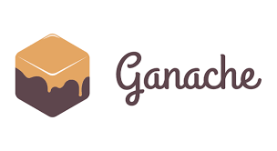

<h1 align="center">CARBOGO</h1>


<p align="center">
 <br><br>
<a href="" target="blank"></a>
<a href="" target="blank"></a>
<a href="" target="blank"></a>
<a href="" target="blank"></a>
<a href="" target="blank"></a>

</p>


<br>

<h4 align="center">We have build a DApp (Decentralized Application) CARBOGO which will serve as a single platform where the government can issue carbon credits and the factories can purchase these carbon credits according to the calculated daily carbon usage of the day.</h4>

<p align="center">A carbon credit represents the right to emit a measured amount of greenhouse gases. Carbon credits work as a certification that business or individual owning them is counterbalancing the emission of greenhouse gases (GHG).</p>

<br>

## Installation and Setup :

### **Node.JS**

##### **For Windows Users :**
Download it by clicking [here](https://nodejs.org/en/).

*It is recommended that you download LTS version.*


##### **For Linux Users :**
Go to your terminal and type :
 ```
$ sudo apt install nodejs
$ sudo apt install npm
 ```

<br>

### **Ganache Local Development Blockchain**
We recommend using [Ganache](https://www.trufflesuite.com/ganache) as your personal blockchain for Ethereum development. It will allow you to deploy smart contracts, develop applications, and run tests. It is available on Windows, Mac, and Linux as a desktop application and a command-line tool !

Download it by clicking [here](https://www.trufflesuite.com/ganache).  *(For both Windows and Linux)*

##### **For Linux Users :**

*Once the download is complete, go to the folder where you have downloaded the file and open the terminal and type the following to make the file executable :*
```
Chmod a+x <filename.AppImage>
```

<br>

### **Metamask Wallet**

For this project, we would require an ethereum wallet, and here we will use the popular open-source wallet metamask.

**On chrome/firefox/brave :** *(It is recommended that you use Brave browser)*

1. Go to the extensions page of your browser and install the metamask plugin, click [here](https://chrome.google.com/webstore/detail/metamask/nkbihfbeogaeaoehlefnkodbefgpgknn).
2. On installation the user will be redirected to a setup page and the user has to choose a password and a recovery phrase.

For in-depth detail click [here](https://docs.metamask.io/guide/)

<br>

### React Truffle Box

First ensure you are in an empty directory.

Run the `unbox` command using 1 of 2 ways.

```sh
# Install Truffle globally and run `truffle unbox`
$ npm install -g truffle
$ truffle unbox react
```

```sh
# Alternatively, run `truffle unbox` via npx
$ npx truffle unbox react
```

Start the react dev server.

```sh
$ cd client
$ npm start
  Starting the development server...
```

From there, follow the instructions on the hosted React app. It will walk you through using Truffle and Ganache to deploy the `SimpleStorage` contract, making calls to it, and sending transactions to change the contract's state.

### FAQ

- __How do I use this with Ganache (or any other network)?__

  The Truffle project is set to deploy to Ganache by default. If you'd like to change this, it's as easy as modifying the Truffle config file! Check out [our documentation on adding network configurations](https://trufflesuite.com/docs/truffle/reference/configuration/#networks). From there, you can run `truffle migrate` pointed to another network, restart the React dev server, and see the change take place.

- __Where can I find more resources?__

  This Box is a sweet combo of [Truffle](https://trufflesuite.com) and [Create React App](https://create-react-app.dev). Either one would be a great place to start!
